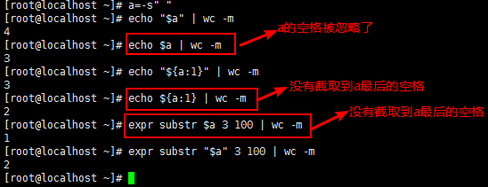

常用环境变量
==============

shell脚本中常用的环境变量有

- \ `IFS <#ifsl>`_\ 
- \ `RANDOM <#randoml>`_\ 

.. _ifsl:

0x00 IFS
~~~~~~~~~~

shell下的很多命令都会分割单词，绝大多数时候默认是采用空格作为分隔符，有些时候遇到制表符、换行符也会进行分隔；这种分隔符是由\ ``IFS``\ 环境变量指定的

\ ``IFS``\ 是shell内部字段分隔符的环境变量

.. figure:: images/1.png

由上图可知：默认的\ ``IFS``\ 在碰到\ ``空格``\ 、\ ``制表符\t``\ 或 \ ``分行符\n``\ 就会自动分隔进入下一步；但是对空格处理有点不一样，对行首和行尾两边的空格不处理，并且多个连续的空格默认当作一个空格

有些时候在编写脚本或执行循环的时候，修改\ ``IFS``\ 可以起很大作用。如果要修改\ ``IFS``\ ，最好记得先备份系统\ ``IFS``\ ，再需要的地方再还原\ ``IFS``\ 

.. figure:: images/2.png

大多数时候，我们都不会去修改\ ``IFS``\ 来达到某种目的，而是采用其他方法来替代实现。这样就需要注意默认\ ``IFS``\ 的一个特殊性，它会忽略前导空白和后缀空白，并压缩连续空白；但是在某些时候，这会出现意想不到的问题

因此，\ **在可以对变量加引号的情况下，一定要加上引号来保护空白字符**\ 

.. _randoml:

0x01 RANDOM
~~~~~~~~~~~~~

\ ``RANDOM``\ 环境变量是bash的伪随机数生成器

- $RANDOM=======生成0~32767之间的随机数
- $[RANDOM%num]===生成0~num之间的随机数；对算术表达式的值进行引用时需要使用[]

代码示例：通过脚本生成n个随机数(N>5),对这些随机数按从小到大排序

.. code-block:: sh

    #!/bin/bash
    declare -a arrynumber
    read -p "Enter a number:" opt
    opt=$[opt-1]
    for i in `seq 0 $opt`;do
      arrynumer[$i]=$[RANDOM%1000]
    done
    let length=${#arrynumer[@]}
    length=$[length-1]
    for i in `seq 0 $length`;do
      let j=i+1
      for j in `seq $j $length`; do
          if [ ${arrynumer[$j]} -lt ${arrynumer[$i]} ];then
            temp=${arrynumer[$j]}
            arrynumer[$j]=${arrynumer[$i]}
            arrynumer[$i]=$temp
          fi
      done
      echo ${arrynumer[$i]}
    done