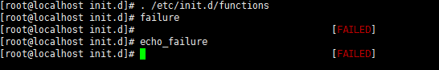
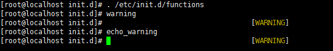
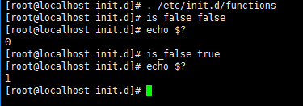
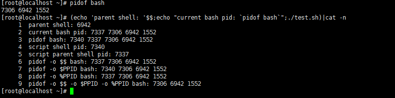

常用函数
=================

参考文档：\ `functions文件详细分析和说明 <http://www.cnblogs.com/f-ck-need-u/p/7518142.html#9->`_\ 

shell中函数和命令不一样，它没有对应的二进制文件，只有相关的声明定义

shell中函数可以大致分为两大类：\ ``自定义函数``\ 和\ ``库函数``\ 

\ ``自定义函数``\ 好说，直接在脚本中自行声明定义和调用即可；在这里我们主要是介绍\ ``库函数``\ ，shell中所谓\ ``库函数``\ 就是\ ``/etc/rc.d/init.d/functions``\ 文件中定义的系统函数，这些系统函数几乎被\ ``/etc/rc.d/init.d/``\ 下所有的sysv服务启动脚本加载，在该文件中提供了以下几个非常有用的函数

- \ `显示函数 <#displaylf>`_\ 

	- \ `success <#successl>`_\ ：显示绿色的\ ``OK``\ ，表示成功
	- \ `failure <#failurel>`_\ ：显示红色的\ ``FAILED``\ ，表示失败
	- \ `passed <#passedl>`_\ ：显示黄色的\ ``PASSED``\ ，表示pass该任务
	- \ `warning <#warningl>`_\ ：显示黄色的\ ``warning``\ ，表示警告
	- \ `confirm <#confirml>`_\ ：提示\ ``(Y)es/(N)o/(C)ontinue? [Y]``\ 并判断、传递输入的值
	- \ `is_true <#truel>`_\ ：\ ``$1``\ 的布尔值代表为真时，返回状态码\ ``0``\ ，否则返回\ ``1``\ ；包括\ ``t/y/yes/true``\ ，不区分大小写
	- \ `is_false <#falsel>`_\ ：\ ``$1``\ 的布尔值代表为假时，返回状态码\ ``0``\ ，否则返回\ ``1``\ ；包括\ ``f/n/no/false``\ ，不区分大小写
	- \ `action <#actionl>`_\ ：根据进程退出状态码自行判断是执行\ ``success``\ 还是\ ``failure``\ 
- \ `进程函数 <#processlf>`_\ 

	- \ `checkpid <#checkpidl>`_\ ：检查\ ``/proc``\ 下是否有给定\ ``pid``\ 对应的目录，给定多个\ ``pid``\ 时，只要存在一个目录都返回状态码\ ``0``\ 
	- \ `__pids_var_run <#runl>`_\ ：检查\ ``pid``\ 是否存在，并保存到变量\ ``pid``\ 中，同时返回几种进程状态码
	- \ `__pids_pidof <#pidl>`_\ ：获取进程\ ``pid``\ 
	- \ `pidfileofproc <#pidproc>`_\ ：获取进程\ ``pid``\ ，但只能获取\ ``/var/run``\ 下的\ ``pid``\ 文件中的值
	- \ `pidofproc <#pidprocll>`_\ ：获取进程\ ``pid``\ ，可获取任意给定\ ``pidfile``\ 或默认\ ``/var/run``\ 下\ ``pidfile``\ 中的值
	- \ `status <#statusl>`_\ ：检查给定进程的运行状态
	- \ `daemon <#daemonl>`_\ ：启动一个服务程序，启动前还检查进程是否已在运行
	- \ `killproc <#killprocl>`_\ ：杀掉给定的服务进程


以下是\ ``/etc/init.d/functions``\ 文件的开头定义的语句(本文分析的\ ``/etc/init.d/functions``\ 文件是\ ``CentOS 7``\ 上的，和\ ``CentOS 6``\ 有些许区别)

- 设置\ ``umask``\ 值，使得加载该文件的脚本所在shell的umask为22
- 导出\ ``PATH``\ 路径变量，但这个导出的路径变量并不理想，因为要为\ ``非rpm包``\ 安装的程序设计服务启动脚本时，必须写全路径命令，例如\ ``/usr/local/mysql/bin/mysql``\ ，因此，可以考虑将\ ``/etc/init.d/functions``\ 中的该语句注释掉

.. code-block:: sh

	# Make sure umask is sane
	umask 022

	# Set up a default search path.
	PATH="/sbin:/usr/sbin:/bin:/usr/bin"
	export PATH


.. _displaylf:

0x00 显示函数
~~~~~~~~~~~~~~~~~~

显示函数常用在编写系统服务启动脚本，便于提示相关启动信息

.. _successl:

0x0000 success
~~~~~~~~~~~~~~~~

除了\ ``success``\ 函数，还有\ ``echo_success``\ 函数也可以显示绿色的\ ``OK``\ ，表示成功

以下是\ ``echo_success``\ 和\ ``success``\ 函数的定义语句

.. code-block:: sh

	echo_success() {
	    [ "$BOOTUP" = "color" ] && $MOVE_TO_COL
	    echo -n "["
	    [ "$BOOTUP" = "color" ] && $SETCOLOR_SUCCESS
	    echo -n $"  OK  "
	    [ "$BOOTUP" = "color" ] && $SETCOLOR_NORMAL
	    echo -n "]"
	    echo -ne "\r"
	    return 0
	}


	success() {
		[ "$BOOTUP" != "verbose" -a -z "${LSB:-}" ] && echo_success
		return 0
	}

这两个函数的功能就是：不换行带绿色输出\ ``[OK]``\ 字样；效果如下

.. figure:: images/1.png


.. _failurel:

0x0001 failure
~~~~~~~~~~~~~~~~

除了\ ``failure``\ 函数，还有\ ``echo_failure``\ 函数也可以显示红色的\ ``FAILED``\ ，表示失败

以下是\ ``echo_failure``\ 和\ ``failure``\ 函数的定义语句

.. code-block:: sh

	echo_failure() {
	    [ "$BOOTUP" = "color" ] && $MOVE_TO_COL
	    echo -n "["
	    [ "$BOOTUP" = "color" ] && $SETCOLOR_FAILURE
	    echo -n $"FAILED"
	    [ "$BOOTUP" = "color" ] && $SETCOLOR_NORMAL
	    echo -n "]"
	    echo -ne "\r"
	    return 1
	}


	failure() {
	    local rc=$?
	    [ "$BOOTUP" != "verbose" -a -z "${LSB:-}" ] && echo_failure
	    [ -x /bin/plymouth ] && /bin/plymouth --details
	    return $rc
	}


这两个函数的功能就是：不换行带红色输出\ ``[FAILED]``\ 字样；效果如下



.. _passedl:

0x0002 passed
~~~~~~~~~~~~~~

除了\ ``passed``\ 函数，还有\ ``echo_passed``\ 函数也可以显示黄色的\ ``PASSED``\ ，表示pass该任务

以下是\ ``echo_passed``\ 和\ ``passed``\ 函数的定义语句

.. code-block:: sh

	echo_passed() {
	    [ "$BOOTUP" = "color" ] && $MOVE_TO_COL
	    echo -n "["
	    [ "$BOOTUP" = "color" ] && $SETCOLOR_WARNING
	    echo -n $"PASSED"
	    [ "$BOOTUP" = "color" ] && $SETCOLOR_NORMAL
	    echo -n "]"
	    echo -ne "\r"
	    return 1
	}


	passed() {
	    local rc=$?
	    [ "$BOOTUP" != "verbose" -a -z "${LSB:-}" ] && echo_passed
	    return $rc
	}


这两个函数的功能就是：不换行带黄色输出\ ``[PASSED]``\ 字样；效果如下

.. figure:: images/3.png

.. _warningl:

0x0003 warning
~~~~~~~~~~~~~~~~

除了\ ``warning``\ 函数，还有\ ``echo_warning``\ 函数也可以显示黄色的\ ``warning``\ ，表示警告

以下是\ ``echo_warning``\ 和\ ``warning``\ 函数的定义语句

.. code-block:: sh

	echo_warning() {
	    [ "$BOOTUP" = "color" ] && $MOVE_TO_COL
	    echo -n "["
	    [ "$BOOTUP" = "color" ] && $SETCOLOR_WARNING
	    echo -n $"WARNING"
	    [ "$BOOTUP" = "color" ] && $SETCOLOR_NORMAL
	    echo -n "]"
	    echo -ne "\r"
	    return 1
	}


	warning() {
	    local rc=$?
	    [ "$BOOTUP" != "verbose" -a -z "${LSB:-}" ] && echo_warning
	    return $rc
	}


这两个函数的功能就是：不换行带黄色输出\ ``[WARNING]``\ 字样；效果如下



.. _confirml:

0x0004 confirm
~~~~~~~~~~~~~~~~

这个函数一般用不上，因为脚本本来就是为了避免交互式的。在\ ``CentOS 7``\ 的\ ``functions``\ 中已经删除了该函数定义语句。不过，借鉴下它的处理方法还是不错的

以下摘自\ ``CentOS 6.6``\ 的\ ``/etc/init.d/functions``\ 文件

.. code-block:: sh

	# returns OK if $1 contains $2
	strstr() {
		[ "${1#*$2*}" = "$1" ] && return 1   # 参数$1中不包含$2时，返回1，否则返回0
		return 0
	}

	# Confirm whether we really want to run this service
	confirm() {
		[ -x /bin/plymouth ] && /bin/plymouth --hide-splash
		while : ; do 
			echo -n $"Start service $1 (Y)es/(N)o/(C)ontinue? [Y] "
			read answer
			if strstr $"yY" "$answer" || [ "$answer" = "" ] ; then
	        	return 0
	      	elif strstr $"cC" "$answer" ; then
	     		rm -f /var/run/confirm
	     		[ -x /bin/plymouth ] && /bin/plymouth --show-splash
	         	return 2
	      	elif strstr $"nN" "$answer" ; then
	        	return 1
	      	fi
	  	done
	}

上述代码中

- 第一个函数\ ``strstr``\ 的作用是判断第一个参数\ ``$1``\ 中是否包含了\ ``$2``\ ，如果包含了则返回状态码\ ``0``\ ,，这函数也是一个不错的技巧
- 第二个函数\ ``confirm``\ 的作用是根据交互式输入的值返回不同的状态码，如果输入的是\ ``y``\ 或\ ``Y``\ 或不输入时，返回\ ``0``\ 。输入的是\ ``c``\ 或\ ``C``\ 时，返回状态码\ ``2``\ ，输入的是\ ``n``\ 或\``N``\ 时返回状态码\ ``1``\ 

于是可以根据\ ``confirm``\ 的状态值决定是否要继续执行某个程序，用法和效果如下

.. figure:: images/5.png

.. _truel:

0x0005 is_true
~~~~~~~~~~~~~~~~~

以下是\ ``is_true``\ 函数的定义语句

.. code-block:: sh

	# Evaluate shvar-style booleans
	is_true() {
	    case "$1" in
	    [tT] | [yY] | [yY][eE][sS] | [oO][nN] | [tT][rR][uU][eE] | 1)
	        return 0
	        ;;
	    esac
	    return 1
	}

由以上代码可知：这个函数的作用就是转换输入的布尔值为状态码；\ ``$1``\ 第一个函数参数的布尔值代表为真(包括\ ``t/y/yes/true``\ ，不区分大小写)时，返回状态码\ ``0``\ ，否则返回\ ``1``\ 

.. figure:: images/6.png

.. _falsel:

0x0006 is_false
~~~~~~~~~~~~~~~~~~

以下是\ ``is_false``\ 函数的定义语句

.. code-block:: sh

	# Evaluate shvar-style booleans
	is_false() {
	    case "$1" in
	    [fF] | [nN] | [nN][oO] | [oO][fF][fF] | [fF][aA][lL][sS][eE] | 0)
	        return 0
	        ;;
	    esac
	    return 1
	}


由以上代码可知：这个函数的作用就是转换输入的布尔值为状态码；\ ``$1``\ 第一个函数参数的布尔值代表为假(包括\ ``f/n/no/false``\ ，不区分大小写)时，返回状态码\ ``0``\ ，否则返回\ ``1``\ 



.. _actionl:

0x0007 action
~~~~~~~~~~~~~~~~~

该函数在写脚本时还比较有用，可以根据退出状态码自动判断是执行\ ``success``\ 还是执行\ ``failure``\ 函数

以下是\ ``action``\ 函数的定义语句

.. code-block:: sh

	# Run some action. Log its output.
	action() {
	    local STRING rc

	    STRING=$1
	    echo -n "$STRING "
	    shift
	    "$@" && success $"$STRING" || failure $"$STRING"
	    rc=$?
	    echo
	    return $rc
	}

这个函数定义的很有技巧

- 先将第一个参数保存并踢掉，再执行后面的命令(\ ``"$@"``\ 表示执行后面的命令)
- 当\ ``action``\ 函数只有一个参数时，\ ``action``\ 直接返回\ ``OK``\ ，状态码为\ ``0``\ ；当超过一个参数时，第一个参数先被打印，再执行从第二个参数开始的命令

在脚本中使用\ ``action``\ 函数时，可以让命令执行成功与否的判断显得更专业，效果如下

.. figure:: images/8.png


通常，该函数会结合\ ``/bin/true``\ 和\ ``/bin/false``\ 命令使用，它们无条件返回\ ``0``\ 或\ ``1``\ 状态码；例如，\ ``mysqld``\ 启动脚本中，判断\ ``mysqld``\ 已在运行时，直接输出启动ok的消息，但实际上根本没做任何事

.. code-block:: sh

	# action函数使用格式
	# action $"MESSAGES: " /bin/true
	# action $"MESSAGES: " /bin/false

	if [ $MYSQLDRUNNING = 1 ] && [ $? = 0 ]; then
		# already running, do nothing
		action $"Starting $prog: " /bin/true
		ret=0
	fi

.. _processlf:

0x01 进程函数
~~~~~~~~~~~~~~~~~

启动进程时，\ ``pid文件``\ 非常重要

- \ ``pid文件``\ 不仅可以用来判断进程是否在运行，还可以从中读取\ ``pid号``\ 用来杀进程
- \ ``pid文件``\ 中可能有多行，表示多实例

.. _checkpidl:

0x0100 checkpid
~~~~~~~~~~~~~~~~~

\ ``checkpid``\ 函数是用来检测给定的\ ```pid值``\ 在\ ``/proc``\ 下是否有对应的目录存在

以下是函数\ ``checkpid``\ 的定义语句

.. code-block:: sh

	# Check if any of $pid (could be plural) are running
	checkpid() {
	    local i

	    for i in $* ; do      # 检测/proc目录下是否存在给定的进程目录
	        [ -d "/proc/$i" ] && return 0
	    done
	    return 1
	}


每个进程都必有一个\ ``pid``\ ，但并不一定都记录在\ ``pid文件``\ 中，例如线程的\ ``pid``\ ；但无论如何，在\ ``/proc/``\ 目录下，一定会有\ ``pid号``\ 命名的目录，只要有对应\ ``pid号``\ 的目录，就表示该进程已经在运行

在检查\ ``/proc``\ 下是否有给定\ ``pid``\ 对应的目录，无论给定多少个\ ``pid``\ ，只要有一个有目录，都返回\ ``0``\ 

该函数的调用方法如下

.. code-block:: sh

	checkpid pid_list

效果图如下

.. figure:: images/10.png

.. _runl:

0x0101 __pids_var_run
~~~~~~~~~~~~~~~~~~~~~~

\ ``__pids_var_run``\ 函数是用来判断给定程序的运行状态以及对应的pid文件是否存在

以下是函数\ ``__pids_var_run``\ 的定义语句

.. code-block:: sh

	# __proc_pids {program} [pidfile]
	# Set $pid to pids from /var/run* for {program}.  $pid should be declared
	# local in the caller.
	# Returns LSB exit code for the 'status' action

	# 通过检测pid判断程序是否已在运行
	__pids_var_run() {
	    local base=${1##*/}                       # 获取进程名的basename
	    local pid_file=${2:-/var/run/$base.pid}   # 定义pid文件路径
	    local pid_dir=$(/usr/bin/dirname $pid_file > /dev/null)
	    local binary=$3

	    [ -d "$pid_dir" -a ! -r "$pid_dir" ] && return 4

	    pid=
	    if [ -f "$pid_file" ] ; then   # 判断给定的pid文件是否存在
	            local line p

	        [ ! -r "$pid_file" ] && return 4 # "user had insufficient privilege"
	        while : ; do                     # 将pid文件中的pid值赋值给pid变量
	            read line
	            [ -z "$line" ] && break
	            for p in $line ; do
	                if [ -z "${p//[0-9]/}" ] && [ -d "/proc/$p" ] ; then
	                    if [ -n "$binary" ] ; then
	                        local b=$(readlink /proc/$p/exe | sed -e 's/\s*(deleted)$//')
	                        [ "$b" != "$binary" ] && continue
	                    fi
	                    pid="$pid $p"
	                fi
	            done
	        done < "$pid_file"

	            if [ -n "$pid" ]; then # pid存在，则返回0，否则表示pid文件存在，但/proc下没有对应命令
	                    return 0       # 即进程已死，但pid文件却存在，返回状态码1
	            fi
	        return 1 # "Program is dead and /var/run pid file exists"
	    fi
	    return 3 # "Program is not running"pid文件不存在时，表示进程未进行，返回状态码3
	}

由函数定义可知：只有当\ ``pid文件``\ 存在，且\ ``/proc``\ 下有\ ``pid``\ 对应的目录时，才表示进程在运行(当然线程没有\ ``pid文件``\ )，该函数的调用方法是：\ ``__pids_var_run program [pidfile]``\ 

- \ ``program``\ 为程序进程名
- \ ``pidfile``\ 为进程pid文件名，如果不给定\ ``pidfile``\ ，则默认为\ ``/var/run/$base.pid``\ 文件

	- \ ``pidfile``\ 的路径可能为\ ``/var/run/$base.pid``\ 文件(\ ``$base``\ 表示进程名的\ ``basename``\ )，此路径为默认值
	- \ ``pidfile``\ 的路径也可能是自定义的路径，例如\ ``mysql``\ 的\ ``pid``\ 可以自定义为\ ``/mysql/data/mysql01.pid``\
- 函数的执行结果有4种状态返回码

	- \ ``0``\ ：表示\ ``program``\ 正在运行
	- \ ``1``\ ：表示\ ``program``\ 进程已死，\ ``pid文件``\ 存在，但\ ``/proc``\ 目录下没有对应的文件
	- \ ``3``\ ：表示pid文件不存在
	- \ ``4``\ ：表示pid文件的权限错误，不可读
- 函数还会保存变量pid的结果，以供其他程序引用

这个函数非常重要，不仅可以从\ ``pidfile``\ 中获取并保存\ ``pid``\ 号码，还根据情况返回几种状态码，这几个状态码是\ ``status``\ 函数的重要依据，在\ ``SysV``\ 服务启动脚本中使用非常广泛

该函数的调用方法如下

.. code-block:: sh

	__pids_var_run program [pidfile]

以下是\ ``httpd``\ 进程的测试结果，分别是\ ``指定pid文件``\ 和\ ``不指定pid文件``\ 的情况

.. figure:: images/11.png

.. _pidl:

0x0102 __pids_pidof
~~~~~~~~~~~~~~~~~~~~

\ ``__pids_pidof``\ 函数是用来获取给定进程的\ ``pid``\ 

以下是函数\ ``__pids_pidof``\ 的定义语句

.. code-block:: sh

	# Output PIDs of matching processes, found using pidof
	# 忽略当前shell的PID，父shell的PID，调用pidof程序shell的PID
	__pids_pidof() {
	    pidof -c -m -o $$ -o $PPID -o %PPID -x "$1" || \
	        pidof -c -m -o $$ -o $PPID -o %PPID -x "${1##*/}"
	}

由以上代码可知：该函数使用了\ ``pidof``\ 命令，获取给定进程的\ ``pid``\ 值会更加精确，其中使用了几个\ ``-o``\ 选项，它用于忽略指定的\ ``pid``\ 

- \ ``-o $$``\ 表示忽略当前shell进程PID，大多数时候它会继承父shell的pid，但在脚本中时它代表的是脚本所在shell的pid
- \ ``-o $PPID``\ 表示忽略父shell进程PID
- \ ``-o %PPID``\ 表示忽略调用pidof命令的shell进程PID

关于\ ``pidof``\ 命令我们在这里简单介绍下，示例脚本如下

.. code-block:: sh

	#!/bin/bash

	echo 'pidof bash: '`pidof bash`
	echo 'script shell pid: '`echo $$`
	echo 'script parent shell pid: '`echo $PPID`
	echo 'pidof -o $$ bash: '`pidof -o $$ bash`
	echo 'pidof -o $PPID bash: '`pidof -o $PPID bash`
	echo 'pidof -o %PPID bash: '`pidof -o %PPID bash`
	echo 'pidof -o $$ -o $PPID -o %PPID bash: '`pidof -o $$ -o $PPID -o %PPID bash`

效果如下



上述效果图中

- 第一个\ ``pidof命令``\ 显示结果中说明当前已有3个bash，pid分别为\ ``3306、2436、2302``\ 
- 第二个命令显示结果中

	- 行1说明括号的父shell为6942
	- 行5说明脚本的父shell为7337。即括号的父shell为当前bash环境，脚本的父shell为括号所在shell
	- 行2减第一个命令的结果说明括号所在子shell的pid为7337
	- 行3减行2说明shell脚本所在子shell的pid为7340
	- \ ``-o $$``\ 忽略的是当前shell，即脚本所在shell的pid，因为在shell脚本中时，$$不继承父shell的pid
	- \ ``-o $PPID``\ 忽略的是pidof所在父shell，即括号所在shell
	- \ ``-o %PPID``\ 忽略的是调用pidof程序所在的shell，即脚本所在shell


.. _pidproc:

0x0103 pidfileofproc
~~~~~~~~~~~~~~~~~~~~~

\ ``pidfileofproc``\ 函数用来获取给定程序的\ ``pid``\ ，注意该函数不是获取\ ``pidfile``\ ，而是获取\ ``pid值``\ 

以下是函数\ ``pidfileofproc``\ 的定义语句

.. code-block:: sh

	# A function to find the pid of a program. Looks *only* at the pidfile
	pidfileofproc() {
	    local pid

	    # Test syntax.
	    if [ "$#" = 0 ] ; then
	        echo $"Usage: pidfileofproc {program}"
	        return 1
	    fi

	    __pids_var_run "$1"         # 不提供pidfile，因此认为是/var/run/$base.pid
	    [ -n "$pid" ] && echo $pid
	    return 0
	}

由以上代码可知：\ ``pidfileofproc``\ 函数只能获取\ ``/var/run``\ 下的\ ``pid值``\ 

该函数用的比较少，但确实有使用它的脚本；如\ ``crond``\ 启动脚本中借助\ ``pidfileofproc``\ 来杀进程

.. code-block:: sh

	echo -n $"Stopping $prog: "
	if [ -n "`pidfileofproc $exec`" ]; then
		killproc $exec
		RETVAL=3
	else
		failure $"Stopping $prog"
	fi

.. _pidprocll:

0x0104 pidofproc
~~~~~~~~~~~~~~~~~~

\ ``pidofproc``\ 函数也可以用来获取给定程序的\ ``pid``\ ，注意该函数不是获取\ ``pidfile``\ ，而是获取\ ``pid值``\ 

以下是函数\ ``pidofproc``\ 的定义语句

.. code-block:: sh

	# A function to find the pid of a program.
	pidofproc() {
	    local RC pid pid_file=

	    # Test syntax.
	    if [ "$#" = 0 ]; then
	        echo $"Usage: pidofproc [-p pidfile] {program}"
	        return 1
	    fi
	    if [ "$1" = "-p" ]; then    # 既可以获取/var/run/$base.pid中的pid
	        pid_file=$2             # 也可以获取自给定pid文件中的pid
	        shift 2
	    fi
	    fail_code=3 # "Program is not running"

	    # First try "/var/run/*.pid" files
	    __pids_var_run "$1" "$pid_file"
	    RC=$?
	    if [ -n "$pid" ]; then      # $pid不为空时，输出program的pid值
	        echo $pid
	        return 0
	    fi

	    [ -n "$pid_file" ] && return $RC  #  $pid为空，但使用了"-p"指定pidfile时，返回$RC
	    __pids_pidof "$1" || return $RC   #  $pid为空，且$pidfile为空时，获取进程号pid并输出
	}

由以上代码可知：\ ``pidofproc``\ 函数既可以获取\ ``/var/run``\ 下的\ ``pid值``\ ，又可以获取自给定\ ``pidfile``\ 中的\ ``pid值``\ 

该函数用的比较少，但确实有使用它的脚本；如\ ``dnsbind``\ 的\ ``named``\ 服务启动脚本中借助\ ``pidofproc``\ 来判断进程是否已在运行

.. code-block:: sh

	pidofnamed() {
		pidofproc -p "$ROOTDIR$PIDFILE" "$named";
	}

	if [ -n "`pidofnamed`" ]; then
		echo -n $"named: already running"
	  	success
	  	echo
	  	exit 0
	fi

.. _daemonl:

0x0105 daemon
~~~~~~~~~~~~~~~

\ ``daemon``\ 函数用于启动一个程序，并根据结果输出\ ``success``\ 或\ ``failure``\ 

\ ``daemon``\ 函数的定义语句如下

.. code-block:: sh

	# A function to start a program.
	daemon() {
	    # Test syntax.
	    local gotbase= force= nicelevel corelimit
	    local pid base= user= nice= bg= pid_file=
	    local cgroup=
	    nicelevel=0
	    while [ "$1" != "${1##[-+]}" ]; do
	        case $1 in
	        '')
	            echo $"$0: Usage: daemon [+/-nicelevel] {program}" "[arg1]..."
	            return 1
	            ;;
	        --check)
	            base=$2
	            gotbase="yes"
	            shift 2
	            ;;
	        --check=?*)
	            base=${1#--check=}
	            gotbase="yes"
	            shift
	            ;;
	        --user)
	            user=$2
	            shift 2
	            ;;
	        --user=?*)
	            user=${1#--user=}
	            shift
	            ;;
	        --pidfile)
	            pid_file=$2
	            shift 2
	            ;;
	        --pidfile=?*)
	            pid_file=${1#--pidfile=}
	            shift
	            ;;
	        --force)
	            force="force"
	            shift
	            ;;
	        [-+][0-9]*)
	            nice="nice -n $1"
	            shift
	            ;;
	        *)
	            echo $"$0: Usage: daemon [+/-nicelevel] {program}" "[arg1]..."
	            return 1
	            ;;
	      esac
	    done

	    # Save basename.
	    [ -z "$gotbase" ] && base=${1##*/}

	    # See if it's already running. Look *only* at the pid file.
	    __pids_var_run "$base" "$pid_file"

	    [ -n "$pid" -a -z "$force" ] && return

	    # make sure it doesn't core dump anywhere unless requested
	    corelimit="ulimit -S -c ${DAEMON_COREFILE_LIMIT:-0}"

	    # if they set NICELEVEL in /etc/sysconfig/foo, honor it
	    [ -n "${NICELEVEL:-}" ] && nice="nice -n $NICELEVEL"

	    # if they set CGROUP_DAEMON in /etc/sysconfig/foo, honor it
	    if [ -n "${CGROUP_DAEMON}" ]; then
	        if [ ! -x /bin/cgexec ]; then
	            echo -n "Cgroups not installed"; warning
	            echo
	        else
	            cgroup="/bin/cgexec";
	            for i in $CGROUP_DAEMON; do
	                cgroup="$cgroup -g $i";
	            done
	        fi
	    fi

	    # Echo daemon
	    [ "${BOOTUP:-}" = "verbose" -a -z "${LSB:-}" ] && echo -n " $base"

	    # And start it up.
	    if [ -z "$user" ]; then
	       $cgroup $nice /bin/bash -c "$corelimit >/dev/null 2>&1 ; $*"
	    else
	       $cgroup $nice runuser -s /bin/bash $user -c "$corelimit >/dev/null 2>&1 ; $*"
	    fi

	    [ "$?" -eq 0 ] && success $"$base startup" || failure $"$base startup"
	}


daemon函数调用方法

.. code-block:: sh

	daemon [--check=servicename] [--user=USER] [--pidfile=PIDFILE] [--force] program [prog_args]

其中需要注意的是

- 只有\ ``--user``\ 选项可以用来控制\ ``program``\ 启动的环境
- \ ``--check``\ 和\ ``--pidfile``\ 选项都是用来检查是否已运行的，不是用来启动的，如果提供了\ ``--check``\ ，则检查的是名为\ ```servicename``\ 的进程，否则检查的是\ ``program``\ 名称的进程
- \ ``--force``\ 则表示进程已存在时仍启动
- \ ``prog_args``\ 是向\ ``program``\ 传递它的运行参数，一般会从\ ``/etc/sysconfig/$base``\ 文件中获取


例如httpd的启动脚本中

.. code-block:: sh

	echo -n $"Starting $prog: "
	daemon --pidfile=${pidfile} $httpd $OPTIONS

其执行结果大致如下

.. code-block:: sh

	[root@xuexi ~]# service httpd start
	Starting httpd:                            [  OK  ]

还需注意，通常\ ``program``\ 的运行参数可能也是\ ``--``\ 开头的，要和\ ``program``\ 前面的选项区分。例如

.. code-block:: sh

	daemon --pidfile $pidfile --check $servicename $processname --pid-file=$pidfile

其中

- 第二个\ ``--pid-file``\ 是\ ``$processname``\ 的运行参数
- 第一个\ ``--pidfile``\ 是daemon检测\ ``$processname``\ 是否已运行的选项
- 由于提供了\ ``--check $servicename``\ ，所以函数调用语句\ ``__pids_var_run $base [pidfile]``\ 中的\ ``$base``\ 等于\ ``$servicename``\ ，即表示检查\ ``$servicename``\ 进程是否允许；如果没有提供该选项，则检查的是\ ``$processname``\ 

在\ ``SysV``\ 脚本中，\ ``daemon``\ 会配合以下几个语句同时执行

.. code-block:: sh

	echo -n $"Starting $prog: "
	daemon --pidfile=${pidfile} $prog $OPTIONS
	RETVAL=$?
	[ $RETVAL = 0 ] && touch ${lockfile}
	return $RETVAL

\ ``daemon``\ 函数启动程序时，自身就会调用\ ``success``\ 或\ ``failure``\ 函数，所以就不需再使用\ ``action``\ 函数了；如果不使用\ ``daemon``\ 函数启动服务，通常会配合\ ``action``\ 函数，例如：

.. code-block:: sh

	$prog $OPTIONS
	RETVAL=$?
	[ $RETVAL -eq 0 ] && action "Starting $prog" /bin/true && touch ${lockfile}

.. _killprocl:

0x0106 killproc
~~~~~~~~~~~~~~~~~

\ ``killproc``\ 函数的作用是根据给定程序名杀进程；中间它会获取程序名对应的\ ``pid号``\ ，且保证\ ``/proc``\ 目录下没有\ ``pid``\ 对应的目录才表示进程关闭成功

\ ``killproc``\ 函数的定义语句如下

.. code-block:: sh

	# A function to stop a program.
	killproc() {
	    local RC killlevel= base pid pid_file= delay try binary=

	    RC=0; delay=3; try=0
	    # Test syntax.
	    if [ "$#" -eq 0 ]; then
	        echo $"Usage: killproc [-p pidfile] [ -d delay] {program} [-signal]"
	        return 1
	    fi
	    if [ "$1" = "-p" ]; then
	        pid_file=$2
	        shift 2
	    fi
	    if [ "$1" = "-b" ]; then
	        if [ -z $pid_file ]; then
	            echo $"-b option can be used only with -p"
	            echo $"Usage: killproc -p pidfile -b binary program"
	            return 1
	        fi
	        binary=$2
	        shift 2
	    fi
	    if [ "$1" = "-d" ]; then
	        if [ "$?" -eq 1 ]; then
	            echo $"Usage: killproc [-p pidfile] [ -d delay] {program} [-signal]"
	            return 1
	        fi
	        shift 2
	    fi


	    # check for second arg to be kill level
	    [ -n "${2:-}" ] && killlevel=$2

	    # Save basename.
	    base=${1##*/}

	    # Find pid.
	    __pids_var_run "$1" "$pid_file" "$binary"
	    RC=$?
	    if [ -z "$pid" ]; then
	        if [ -z "$pid_file" ]; then
	            pid="$(__pids_pidof "$1")"
	        else
	            [ "$RC" = "4" ] && { failure $"$base shutdown" ; return $RC ;}
	        fi
	    fi

	    # Kill it.
	    if [ -n "$pid" ] ; then
	        [ "$BOOTUP" = "verbose" -a -z "${LSB:-}" ] && echo -n "$base "
	        if [ -z "$killlevel" ] ; then
	            __kill_pids_term_kill -d $delay $pid
	            RC=$?
	            [ "$RC" -eq 0 ] && success $"$base shutdown" || failure $"$base shutdown"
	        # use specified level only
	        else
	            if checkpid $pid; then
	                kill $killlevel $pid >/dev/null 2>&1
	                RC=$?
	                [ "$RC" -eq 0 ] && success $"$base $killlevel" || failure $"$base $killlevel"
	            elif [ -n "${LSB:-}" ]; then
	                RC=7 # Program is not running
	            fi
	        fi
	    else
	        if [ -n "${LSB:-}" -a -n "$killlevel" ]; then
	            RC=7 # Program is not running
	        else
	            failure $"$base shutdown"
	            RC=0
	            __kill_pids_term_kill -d $delay $pid
	            RC=$?
	            [ "$RC" -eq 0 ] && success $"$base shutdown" || failure $"$base shutdown"
	        # use specified level only
	        else
	            if checkpid $pid; then
	                kill $killlevel $pid >/dev/null 2>&1
	                RC=$?
	                [ "$RC" -eq 0 ] && success $"$base $killlevel" || failure $"$base $killlevel"
	            elif [ -n "${LSB:-}" ]; then
	                RC=7 # Program is not running
	            fi
	        fi
	    else
	        if [ -n "${LSB:-}" -a -n "$killlevel" ]; then
	            RC=7 # Program is not running
	        else
	            failure $"$base shutdown"
	            RC=0
	        fi
	    fi

	    # Remove pid file if any.
	    if [ -z "$killlevel" ]; then
	        rm -f "${pid_file:-/var/run/$base.pid}"
	    fi
	    return $RC
	}


由上述代码可知：关闭进程时，需要再三确定\ ``pid文件``\ 是否存在，\ ``/proc``\ 下是否有和\ ``pid``\ 对应的目录。直到\ ``/proc``\ 下已经没有了和\ ``pid``\ 对应的目录时，才表示进程真正杀死了；但此时\ ``pid文件``\ 仍可能存在，因此还要保证\ ``pid文件``\ 已被移除

该函数的调用方法如下

.. code-block:: sh

	killproc [-p pidfile] [ -d delay] {program} [-signal]

其中

- \ ``-p pidfile``\ ：用于指定从此文件中获取进程的\ ``pid号``\ ，不指定时默认从\ ``/var/run/$base.pid``\ 中获取
- \ ``-d delay``\ ：指定未使用\ ``-signal``\ 时的延迟检测时间；有效单位为\ ``秒、分、时、日("smhd")``\ ，不写时默认为秒
- \ ``-signal``\ ：用于指定\ ``kill``\ 发送的信号；如果不指定，则默认先发送\ ``TERM``\ 信号，在\ ``-d delay``\ 时间段内仍不断检测是否进程已经被杀死，如果还未死透，则\ ``delay``\ 超时后发送\ ``KILL``\ 信号强制杀死

需要明确的是，只有\ ``/proc``\ 目录下没有了\ ``pid``\ 对应的目录才算是杀死了；
一般来说，\ ``killproc``\ 前会判断进程是否已在运行，最后还要删除\ ``pid文件``\ 和\ ``lock文件``\ ；当然，\ ``killproc``\ 函数可以保证\ ``pid文件``\ 被删除；所以，\ ``killproc``\ 函数大致会同时配合以下语句用来杀进程

.. code-block:: sh

	status -p ${pidfile} $prog > /dev/null
	if [[ $? = 0 ]]; then
	        echo -n $"Stopping $prog: "
	        killproc -p ${pidfile} -d ${STOP_TIMEOUT} $httpd
	else
	        echo -n $"Stopping $prog: "
	        success
	fi
	RETVAL=$?
	[ $RETVAL -eq 0 ] && rm -f ${lockfile} ${pidfile}

同样注意，\ ``killproc``\ 中已经自带\ ``success``\ 和\ ``failure``\ 函数；如果不使用\ ``killproc``\ 杀进程，则通常会配合\ ``action``\ 函数或者\ ``success``\ 、\``failure``\ ；大致如下

.. code-block:: sh

	killall $prog ； usleep 50000 ； killall $prog
	RETVAL=$?
	if [ "RETVAL" -ne 0 ];then
	    action $"Stopping $prog: " /bin/true
	    rm -rf ${lockfile} ${pidfile}
	else
	    action $"Stoping $prog: " /bin/false
	fi

以上由于采用的是\ ``killall``\ 命令，如果采用的是\ ``kill``\ 命令，则需要先获取进程的\ ``pid``\ ，在此之前还要检查\ ``pid文件``\ 是否存在

.. _statusl:

0x0107 status
~~~~~~~~~~~~~~~

\ ``status``\ 函数用于获取进程的运行状态，有以下几种状态

- \ ``${base} (pid $pid) is running...``\ 
- \ ``${base} dead but pid file exists``\ 
- \ ``${base} status unknown due to insufficient privileges``\ 
- \ ``${base} dead but subsys locked``\ 
- \ ``${base} is stopped``\ 

\ ``status``\ 函数定义语句如下(注意：此为\ ``CentOS 7``\ 上语句，比\ ``CentOS 6``\ 多了一段\ ``systemctl``\ 的处理，用于\ ``Sysv``\ 的\ ``status``\ 状态向\ ``systemd``\ 的\ ``status``\ 状态转换)

.. code-block:: sh

	status() {
	    local base pid lock_file= pid_file= binary=

	    # Test syntax.
	    if [ "$#" = 0 ] ; then
	        echo $"Usage: status [-p pidfile] {program}"
	        return 1
	    fi
	    if [ "$1" = "-p" ]; then
	        pid_file=$2
	        shift 2
	    fi
	    if [ "$1" = "-l" ]; then
	        lock_file=$2
	        shift 2
	    fi
	    if [ "$1" = "-b" ]; then
	        if [ -z $pid_file ]; then
	            echo $"-b option can be used only with -p"
	            echo $"Usage: status -p pidfile -b binary program"
	            return 1
	        fi
	        binary=$2
	        shift 2
	    fi
	    base=${1##*/}

	    if [ "$_use_systemctl" = "1" ]; then
	        systemctl status ${0##*/}.service
	        ret=$?
	        # LSB daemons that dies abnormally in systemd looks alive in systemd's eyes due to RemainAfterExit=yes
	        # lets adjust the reality a little bit
	        if systemctl show -p ActiveState ${0##*/}.service | grep -q '=active$' && \
	        systemctl show -p SubState ${0##*/}.service | grep -q '=exited$' ; then
	            ret=3
	        fi
	        return $ret
	    fi

	    # First try "pidof"
	    __pids_var_run "$1" "$pid_file" "$binary"
	    RC=$?
	    if [ -z "$pid_file" -a -z "$pid" ]; then
	        pid="$(__pids_pidof "$1")"
	    fi
	    if [ -n "$pid" ]; then
	        echo $"${base} (pid $pid) is running..."
	        return 0
	    fi

	    case "$RC" in
	    0)
	        echo $"${base} (pid $pid) is running..."
	        return 0
	        ;;
	    1)
	        echo $"${base} dead but pid file exists"
	        return 1
	        ;;
	    4)
	        echo $"${base} status unknown due to insufficient privileges."
	        return 4
	        ;;
	    esac
	    if [ -z "${lock_file}" ]; then
	        lock_file=${base}
	    fi
	    # See if /var/lock/subsys/${lock_file} exists
	    if [ -f /var/lock/subsys/${lock_file} ]; then
	        echo $"${base} dead but subsys locked"
	        return 2
	    fi
	    echo $"${base} is stopped"
	    return 3
	}

该函数的调用方法如下

.. code-block:: sh

	status [-p pidfile] [-l lockfile] program
	# 如果同时提供了-p和-l选项，-l选项必须放在-p选项后面


